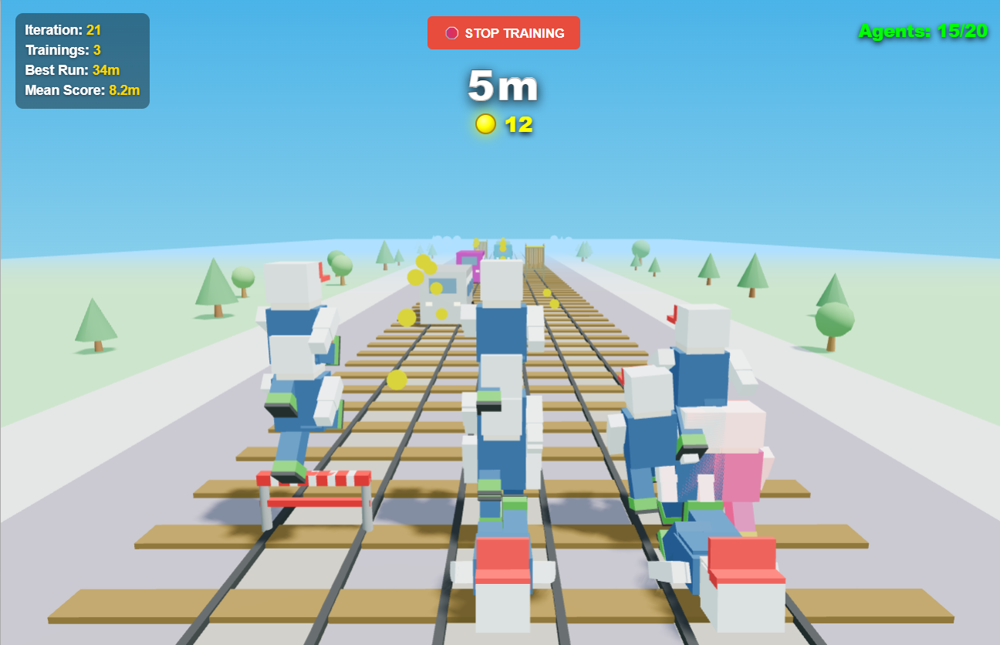

# SubwayAI

## Setup 

### Play game : 
Open game/index.html file in your browser

### Train/use AI:
python3 python/pytorch/main.py





## AI Agent

The AI is trained using **Proximal Policy Optimization (PPO)**, a reinforcement learning algorithm. At each game step, the game sends its current state to a Python server over a WebSocket. The AI picks an action, which is sent back to the game, and the game transitions to a new state. The AI is then given a reward reflecting how well it performed.

---

### Action Space

The agent can choose from **5 discrete actions** at each step:

| Action | Key | Description |
|--------|-----|-------------|
| `L` | Move Left | Shift one lane to the left |
| `R` | Move Right | Shift one lane to the right |
| `J` | Jump | Jump over a low barrier or onto a train |
| `S` | Slide | Slide under a high fence |
| `None` | Do nothing | Stay in the current state |

---

### State Space

The state fed to the neural network is a vector $s$ of **16 normalized values** coming from the game.

#### 1. Player Parameters
- **Lane**: Current horizontal position $\in \{-1.0, 0.0, 1.0\}$ (left, center, right).
- **Y**: Current player height, normalized by 3.0.
- **Sliding**: Whether the player is currently sliding (0.0 or 1.0).
- **Speed**: Current game speed, normalized by 10.0.

#### 2. Obstacles 
For each of the 3 lanes, two values describe the next upcoming obstacle:
- **LX_Z**: Distance of the obstacle from the player. Closer to 0.0 means it is approaching fast. Defaults to 1.0 if no obstacle is visible.
- **LX_T**: Obstacle type, encoding how to avoid it:
    - `-1.0`: **Nothing** — lane is clear.
    - `0.0`: **Low barrier** — can be jumped over or slid under.
    - `0.5`: **High fence** — must slide under.
    - `1.0`: **Train** — must switch lanes or jump on top.

#### 3. Coins 
For each lane, the system tracks coins located **before** the next obstacle on that lane:
- **CX_Z**: Distance to the nearest coin before the obstacle. Defaults to 1.0 if none are visible.
- **CX_N**: Number of coins available before the next obstacle on this lane.

---

### Neural Network Architecture

Both the Actor and the Critic share the same architecture: two fully-connected hidden layers of 64 neurons with Tanh activations. The input is always the state vector $s \in \mathbb{R}^{16}$.

```
Input (16)  →  Linear(64)  →  Tanh  →  Linear(64)  →  Tanh  →  Output
```

---

### Actor-Critic system

The Actor-Critic architecture uses **two separate neural networks** that work together. They are respectively parameterised by vectors $\theta$ and $\phi$.

#### The Actor — "What should I do?"

The Actor takes the current state $s$ and outputs a **probability distribution over the 5 possible actions**:

$$
\pi_\theta(a \mid s) : \mathbb{IR}^{16} \to \mathbb{IR}^{5}
$$
$$
\pi_\theta(a \mid s) = \text{Softmax}(W_3 \cdot \tanh(W_2 \cdot \tanh(W_1 \cdot s)))
$$

It outputs **5 values** (one per action) that sum to 1. An action is then **sampled** from this distribution during training, or the **argmax** is taken during inference. This probabilistic output is essential: if the actor always picked the same action deterministically, it would never explore new strategies.

#### The Critic — "How good is this situation?"

The Critic also takes the state $s$, but outputs a **single scalar**: the estimated value $V(s)$ of being in that state.

$$
V_\phi(s) : \mathbb{IR}^{16} \to \mathbb{IR}
$$

This value represents the expected total future reward from state $s$. It answers the question: *"On average, how much reward can I expect to collect from here onwards?"*

#### Why Two Networks?

The Critic exists to **guide the Actor's learning**. Without it, the Actor would only know whether an episode was good or bad overall — it would have no sense of which specific actions within the episode were responsible. The Critic provides a **baseline**: the advantage $A(s, a)$ measures whether an action was better or worse than what was expected:

$$
A(s, a) = R - V_\phi(s)
$$

where $R$ is the actual discounted return collected. If the advantage is positive, the action was better than expected and the Actor should do it more. If it is negative, the Actor should do it less.

#### Why Different Learning Rates?

```python
lr_actor  = 0.0003
lr_critic = 0.001
```

The Critic is trained with a **higher learning rate** (0.001) because it needs to quickly learn accurate value estimates — it is solving a regression problem with a clear numerical target. If the Critic is slow to converge, the advantage signal used to train the Actor is inaccurate, which destabilizes the whole system.

The Actor is trained more **cautiously** (0.0003) because its updates directly affect the policy that plays the game. Large, aggressive updates could cause the policy to collapse (e.g., always picking the same action). The Actor must improve incrementally to remain stable.

---

### Proximal Policy Optimization

PPO is an Actor-Critic algorithm. “Proximal” means staying close to the original behavior, and “Policy Optimization” is about finding better strategies. On top of the Actor-Critic foundation, it introduces one key innovation: **it prevents the policy from changing too drastically in a single training update**, which makes training far more stable. 

#### Old Policy vs. New Policy

```python
self.policy     = ActorCritic(state_dim, action_dim)  # the policy being trained
self.policy_old = ActorCritic(state_dim, action_dim)  # frozen snapshot used to collect data
```

Two copies of the same network are kept. The **old policy** $\pi_{\theta_\text{old}}$ is a frozen snapshot used to collect gameplay experience — its weights do not change during a training update. The **new policy** $\pi_\theta$ is the one being actively trained.

This separation is fundamental to PPO: to measure how much the policy has shifted, we need to compare the new policy's action probabilities against what they were *when the data was collected*. Without this reference, there would be no way to limit the size of the update. Once training is complete, the old policy is updated to match the new one:

```python
self.policy_old.load_state_dict(self.policy.state_dict())
```

#### Discounted Return

After each episode, a **discounted return** $R_t$ is computed for every timestep $t$. Rather than just using the immediate reward, the agent also cares about future rewards — but discounts them by a factor $\gamma<1$ for each step into the future:

$$
R_t = r_t + \gamma r_{t+1} + \gamma^2 r_{t+2} + \cdots = \sum_{k=0}^{K_{dead}} \gamma^k r_{t+k}
$$

In code, this is computed backwards through the buffer (`gamma = 0.99`):

```python
discounted_reward = reward + gamma * discounted_reward
```

A reward received 100 steps from now is worth $0.99^{100} \approx 0.37$ times a reward received now. This encourages the agent to prefer actions that lead to *sustained* success rather than short-term gains. The returns are then **normalized** (zero mean, unit variance) to stabilize training.

#### Advantage

The **advantage** $A_t$ measures how much better (or worse) a taken action turned out to be compared to what the Critic expected:

$$
A_t = R_t - V_\phi(s_t)
$$

- If $A_t > 0$: the action led to *more* reward than expected — the Actor should do it more often.
- If $A_t < 0$: the action led to *less* reward than expected — the Actor should do it less often.

The Critic's estimate $V_\phi(s_t)$ acts as a **baseline**, reducing the variance of the gradient signal and making learning much more efficient than using raw returns alone.

#### Training Loop

Once enough gameplay has been collected (every 2000 timesteps), the same batch of data is reused for 4 optimization epochs. At each epoch:

1. **Re-evaluate** the actions from the collected data under the *current* (new) policy to get updated log-probabilities and state values.
2. **Compute the probability ratio** between the new and old policy:

$$
r(\theta) = \frac{\pi_\theta(a_t \mid s_t)}{\pi_{\theta_\text{old}}(a_t \mid s_t)} = \exp\left(\log\pi_\theta(a_t \mid s_t) - \log\pi_{\theta_\text{old}}(a_t \mid s_t)\right)
$$

A ratio $r(\theta) > 1$ means the new policy assigns *higher* probability to that action than the old one; $r(\theta) < 1$ means it assigns lower probability.

3. **Compute the clipped surrogate loss** (see below) and backpropagate.

After all epochs, the old policy weights are overwritten with the new policy weights and the buffer is cleared.

#### Loss Function

$$
\mathcal{L}^\text{PPO} = -\mathcal{L}^\text{CLIP}(\theta) + 0.5 \cdot \mathcal{L}^\text{CRITIC}(\phi) - 0.01 \cdot \mathcal{L}^\text{ENT}(\theta)
$$

The total loss has three terms:

**1. Clipped policy loss**

$$
\mathcal{L}^\text{CLIP}(\theta) = \mathbb{E}_t[\min(r(\theta) \cdot A_t,\ \text{clip}(r(\theta), 1-\varepsilon, 1+\varepsilon) \cdot A_t)]
$$

- The first min term is the unclipped objective: the ratio multiplied by the advantage.
- The second mon term clips the ratio to stay within $[1-\varepsilon,\ 1+\varepsilon]$ (here $\varepsilon = 0.2$, so between 0.8 and 1.2), then multiplies by the advantage.
- Taking the **minimum** of the two ensures the update is never too large: if the ratio strays too far from 1 (meaning the policy has changed too much), the clipped version kicks in and limits the gradient. This is the core of PPO.
- The **negative sign** turns this into a minimization problem (standard for gradient descent optimizers).

**2. Critic loss** 

$$
\mathcal{L}^\text{CRITIC}(\phi) = \text{MSE}(V_\phi(s_t), R_t)
$$

The Critic is trained to minimize the mean squared error between its predicted state value and the actual discounted return. The coefficient 0.5 scales its contribution relative to the policy loss.

**3. Entropy loss** 

$$
\mathcal{L}^\text{ENT}(\theta) = H(\pi_\theta(\cdot \mid s_t)) = -\sum_a \pi(a \mid s) \cdot \log(\pi(a \mid s))
$$

Entropy measures how spread out the action probability distribution is. Subtracting it from the loss (i.e., *maximizing* entropy) encourages the policy to remain exploratory and avoid prematurely collapsing onto a single action. The small coefficient (0.01) keeps this effect gentle.


## To Do : 

IA : 
Donner une reward positive quand l'agent passe avec succès un osbtacle
en mode play IA, afficher les probabilités associées aux 5 actions en live
accelerer l'entrainement (augmenter nb agents?)
mean score ne change pas à chaque itération 

Front : 
ca n'accélère plus ?


Save weights command:  
  
python -c "  
import asyncio, websockets, json  
async def send_save():  
    async with websockets.connect('ws://127.0.0.1:8765') as ws:  
        await ws.send(json.dumps({'type': 'save'}))  
asyncio.run(send_save())  
"  
